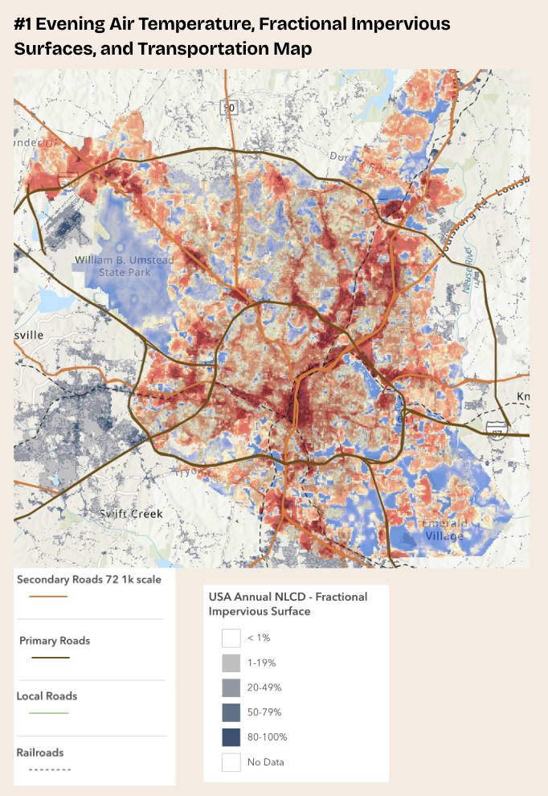
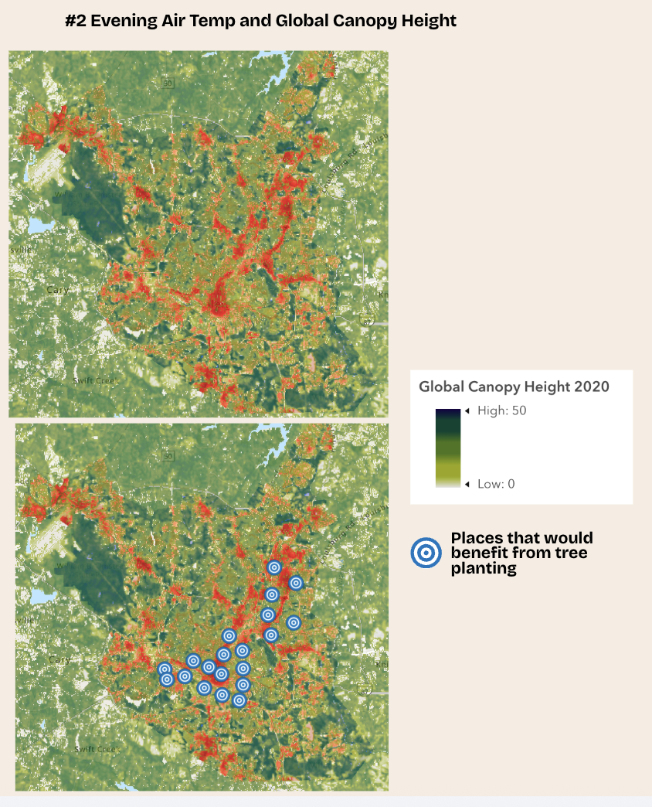
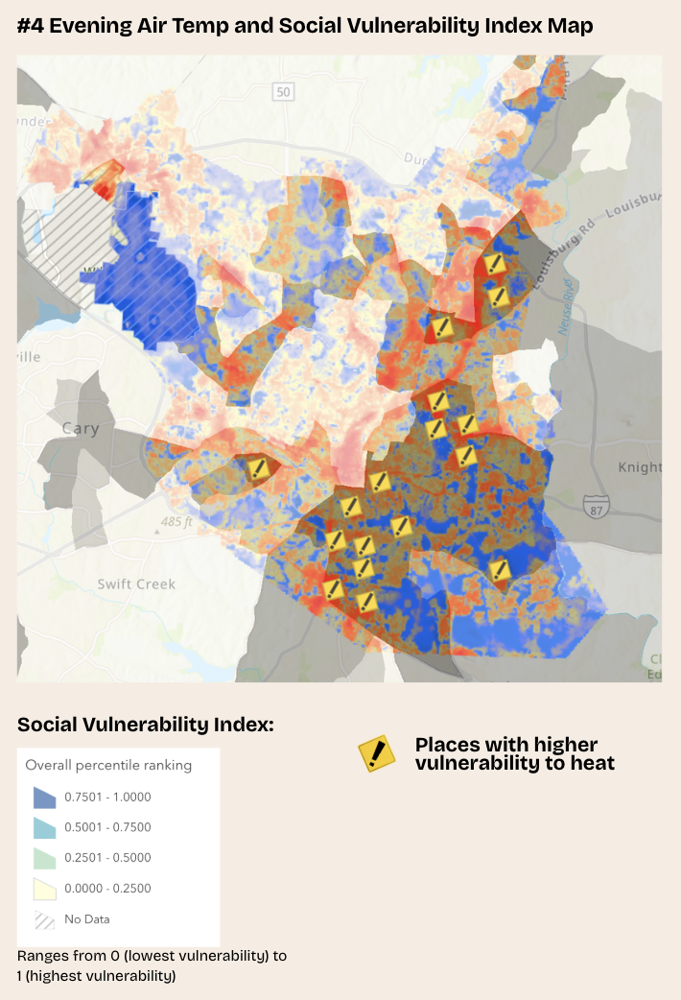
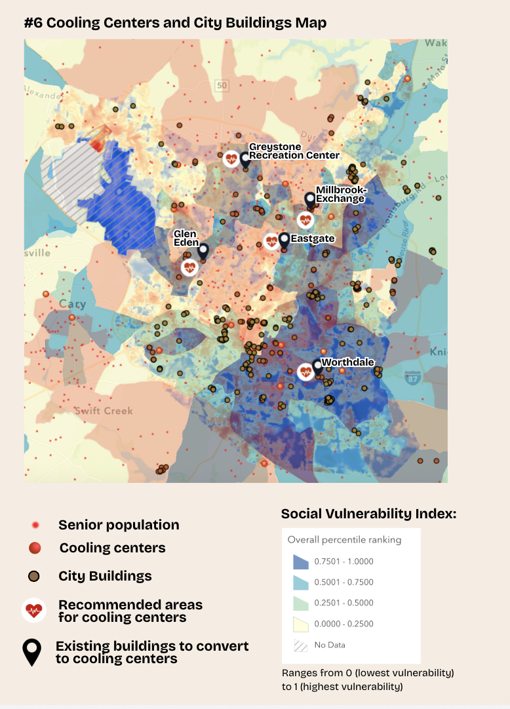

# Urban Heat Island Analysis in Raleigh, North Carolina

A geospatial analysis investigating how land cover, vegetation, and urban development contribute to Urban Heat Island effects across Raleigh using GIS and data analysis.

## Project Overview

Urban Heat Islands (UHIs) occur when developed areas become significantly warmer than surrounding rural regions due to dense infrastructure, impervious surfaces, and limited vegetation. This project analyzes Raleigh, North Carolina using GIS to identify heat hotspots, understand the environmental factors contributing to elevated temperatures, and propose equitable mitigation strategies.

## Research Questions

- Which areas experience the highest surface temperatures?
- How does vegetation and canopy height affect temperature?
- What relationship exists between urbanization and heat?
- Which communities are most vulnerable?
- Where can solutions be implemented to combat the heat island effect?

## Methodology

1. Researched causes and effects of Urban Heat Islands.
2. Collected satellite imagery and datasets of Raleigh from ArcGIS and the City of Raleigh.
3. Generated Evening Air Temperature maps.
4. Layered and compared:
   - Land Cover
   - Impervious Surfaces
   - Transportation
   - Tree Canopy Height
   - Temperature
   - Greenway Trails
   - Social Vulnerability
   - Parking Lots
   - Cooling Centers
   - City Buildings
   - Senior Population
5. Identified high-risk communities.
6. Proposed equitable solutions.
7. Mapped out where to implement specific solutions and target areas.
8. Created infographic map to summarize findings.

## Data Sources

| Dataset | Source | Purpose |
|---|---|---|
| Land Cover | [City of Raleigh](https://www.arcgis.com/home/item.html?id=a0bd0e59810a4179b7d8a8a220493d42#overview) | Identify open water, bare soil, low vegetation areas, tree canopy, and impervious surfaces |
| Evening Air Temperature | [ArcGIS](https://gis.nnvl.noaa.gov/arcgis/rest/services/HINDZ/Evening_Air_Temperature_in_Cities/ImageServer) | Identify developed and undeveloped areas |
| Fractional Impervious Surface | [Esri Environment](https://www.arcgis.com/home/item.html?id=6df535f263dd44f489365eed49461a38) | Calculates the percentage of each pixel that is covered by an impervious surface |
| Transportation (Roads and Railroads) | [Esri Environment](https://www.arcgis.com/home/item.html?id=f42ecc08a3634182b8678514af35fac3) | Displays primary roads, secondary roads, local roads and railroads in the United States. |
| Global Canopy Height | [Esri Environment](https://www.arcgis.com/home/item.html?id=2a3dfb00c2c6425f85bd70da420d58eb) | Displays global vegetation height on a scale with a resolution of 10-m. |
| Social Vulnerability Index | [Centers for Disease Control and Prevention](https://www.arcgis.com/home/item.html?id=05709059044243ae9b42f469f0e06642) | Visualizes overal SVI for US counties and tracts with 16 social factors grouped into four major themes. |
| Parking Lots | [City of Raleigh](https://www.arcgis.com/home/item.html?id=279328c67180440fbc9c4921a40d79f2) | Identifies parking lots by annual planimetric update project. |
| Cooling Centers | [City of Raleigh](https://ral.maps.arcgis.com/home/item.html?id=a91279200432485dad65d477b3975085) | Identifies cooling centers in the city of Raleigh including cooling buildings and libraries. |
| Senior Population Around the Globe | [Esri Environment](https://ral.maps.arcgis.com/home/item.html?id=16ac068ca6f441648e1cafc283a96d53) | Shows where senior populations are found throughout the world with red dots and shading. |
| City Buildings | [Raleigh GIS](https://ral.maps.arcgis.com/home/item.html?id=b127bcbdf2594b2ab127c0fefa41a262) | Displays all city buildings in Raleigh. |
| Raleigh Greenway Trails | [City of Raleigh](https://www.arcgis.com/home/item.html?id=23836bb9145943d485252d9665020ff1) | Displays Raleigh greenway trails and related structures, including segment type, status, material, accessibility, and closure information. |

## Key Findings

### Transportation
Major roads and railroads consistently overlap with higher evening temperatures, suggesting transportation infrastructure contributes to Urban Heat Island intensity.

### Vegetation
Areas with greater tree canopy generally experience lower temperatures, reinforcing the cooling benefits of urban forests and greenways.

### Parking Lots
Large asphalt parking lots strongly correlate with elevated temperatures because of their low albedo and impermeable surfaces.

### Social Vulnerability
Communities with higher social vulnerability often coincide with hotter areas, indicating that heat exposure can disproportionately affect vulnerable populations.

### Cooling Centers
Overlaying heat, social vulnerability, senior populations, and city buildings allowed the identification of locations where additional cooling centers would have the greatest impact.

## Proposed Solutions

### Increase Tree Canopy
Areas with low canopy height consistently overlapped with higher temperatures, while greenways and forested areas remained cooler. Expanding tree canopy in neighborhoods, parking lots, and along major roads can provide shade, reduce surface temperatures through evapotranspiration, and improve air quality. Prioritizing locations with both high heat and low vegetation will maximize the cooling impact.

### Green Roofs
For densely developed areas with limited space for trees, green roofs provide an effective alternative by adding vegetation to rooftops. They help lower rooftop temperatures, reduce building cooling demands, and contribute to a more sustainable urban environment. The analysis recommends implementing green roofs on large public and commercial buildings.

### Cool Roofs
Cool roofs use reflective materials that absorb less heat than traditional roofing, helping reduce both building and surrounding air temperatures. Installing cool roofs on schools, city buildings, and commercial structures can improve energy efficiency while mitigating the Urban Heat Island effect.

### Permeable Parking Lots
Large asphalt parking lots were identified as significant contributors to higher temperatures because they absorb and store solar heat. Replacing traditional pavement with permeable materials and adding vegetation can reduce heat buildup while improving stormwater infiltration. Dorothea Dix Park was identified as a priority location for this strategy.

### Cooling Centers
By combining temperature, social vulnerability, senior population, and city building data, the analysis identified areas that would benefit most from additional cooling centers. Repurposing existing public buildings into cooling centers provides an equitable and cost-effective way to protect vulnerable communities during extreme heat events.

### Expanding Greenway Corridors
Greenways generally corresponded with cooler temperatures, demonstrating the benefits of connected vegetation. Expanding tree coverage along existing greenways—particularly in warmer sections—can strengthen these natural cooling corridors and reduce surrounding temperatures.

## Tools Used
GIS

- ArcGIS Online
- QGIS

Analysis

- Spatial Overlay
- Raster Analysis
- Heat Mapping

Data Sources

- NOAA
- CDC
- Wake County GIS
- NC State Climate Office
- City of Raleigh GIS

## My Contributions
I contributed to:
- Researching solutions and mapping out where to implement solutions
- Created all analysis maps with ArcGIS and layered datasets
- Identified critical hot spots and effective solutions to mitigate heat in that area
- Created visual infographic with solutions and a combination of analysis maps

This was a team project completed with one project partner. Contributions are described to clearly distinguish individual and collaborative work.

## Awards
1st Place, 2026 TSA North Carolina State Conference in Geospatial Technology

## Future Improvements

- Develop an interactive ArcGIS Dashboard for public exploration.
- Analyze multi-year satellite imagery to study long-term Urban Heat Island trends.
- Incorporate Landsat or Sentinel imagery for higher-resolution land surface temperature analysis.
- Apply machine learning to predict future hotspot development under different urban growth scenarios.
